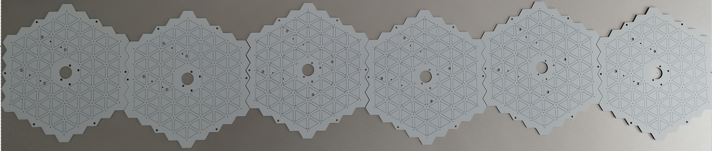
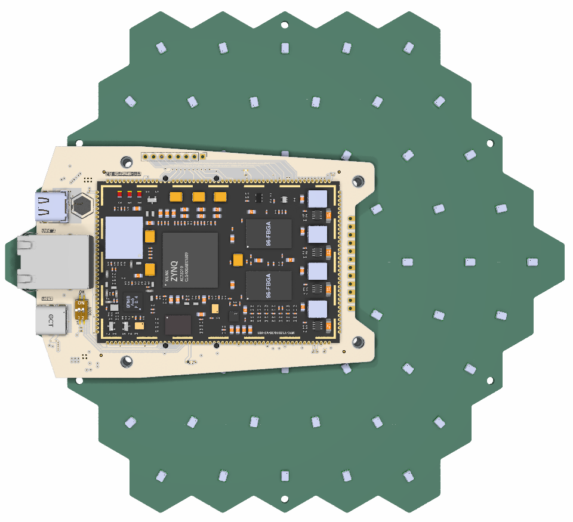
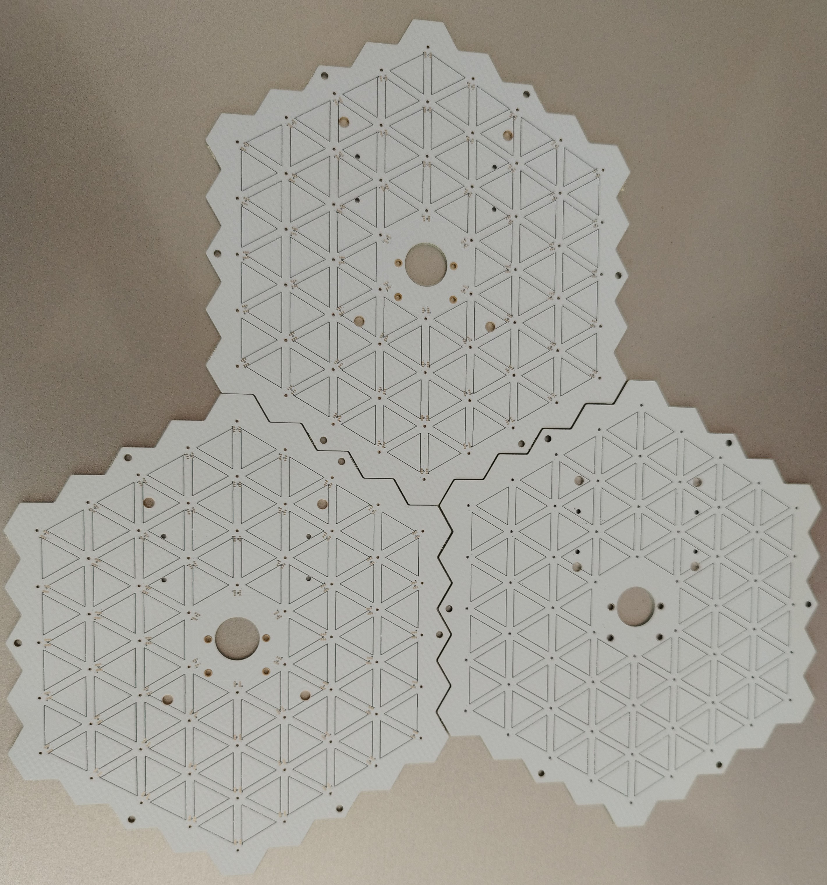

# Sesenta: Open Source Tileable Acoustic Camera

**Status: Work in Progress**

Sesenta is an open-source project for building a tileable acoustic camera using FPGA technology. This project utilizes several open-source components and SDKs to enable advanced acoustic processing and visualization, aimed at developers and researchers interested in affordable, scalable acoustic imaging solutions.

### Project Photos

  
  
  

### Project Dependencies

- **PMD Microphone Implementation**  
  Based on the work from [HDL For Beginners](https://github.com/HDLForBeginners/Examples), this setup provides the foundation for PMD microphone integration.

- **Koheron SDK**  
  The core stack is built using [Koheron SDK](https://github.com/Koheron/koheron-sdk), with custom modifications to enhance functionality and flexibility beyond the standard TCL framework.

- **WS2812/WS2813 LED Driver**  
  The LED driver, adapted from [Matt Venn's ws2812-core](https://github.com/mattvenn/ws2812-core), supports both WS2812 and WS2813 LEDs used on the PCB.

### Project Goals and Progress

- [x] System Bring-Up, Linux, 
- [x] Audio Output and Processing
- [x] Dddr over DMA integration
- [ ] Sum and Delay Beamforming (In Progress)
- [ ] Advanced Beamforming (To Do)
- [ ] Basic Machine Learning for Beamforming (To Do)
- [ ] Camera Integration and Mapping (To Do)

For more information, visit the project on [Hackaday](https://hackaday.io/project/192750-sesenta-open-source-tileable-acoustic-camera).
